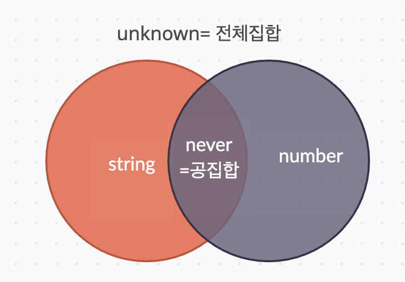

# 2.1 변수, 매개변수, 반환값에 타입을 붙이면 된다.

기본 타입 : string, number, boolean, null, undefined, symbol, bigint,object

타입 표기 방법

- 변수 이름 뒤에 콜론과 함께 표기한다.

```ts
const str: string = "hi";
```

- 매개 변수의 타입은 매개변수 바로 뒤에 표기한다.
- 반환 값의 타입은 함수의 매개변수 소괄호 뒤에 표기한다.

```ts
function plus(x: number; y: number): number {
    return x+y
}
//화살표 함수
const minus = (x:number; y:number) : number => x-y;
```

# 2.2 타입 추론을 적극 활용하자.

```ts
const str: string = "hi"; //-> str 타입은 string
const str = "hi"; //-> str 타입은 "hi"
```

❓왜 다르게 추론될까?

✅ const로 선언했기 때문에 값이 hi 외에는 될 수 없으므로 타입이 'hi' 로 추론되는 것이다.

❓타입스크립트가 추론한 타입과 다른 타입으로 정의해도 될까?

✅ 정확한 타입보다는 부정확하겠지만 더 넓은 타입으로 표기해도 된다.

> 📝 타입 넓히기 특이점
>
> - let을 사용하면 다른 값을 대입할 수 있기 때문에 더 넓은 타입으로 추론된다.
> - let 변수에 null, undefine를 대입하면 any로 추론된다.
> - const sym=Symbol(sym)일때의 타입은 typeof sym이다. let 일때의 타입은 symbol.
> - **unique symbol**끼리는 비교할 수 없다.
> - **unique symbol & symbol** / **symbol & symbol** 은 비교 가능하다.

# 2.3 값 자체가 타입인 리터럴 타입이 있다.

- 리터럴 타입이란<span style="color:#ffd33d"> 정확한 값을 지정하여 더 엄격한 타입을 지정하는 것이다</span>.
  ```ts
  const obj: { name: "zero" } = { name: "zero" };
  const arr: [1, 3, "five"] = [1, 3, "five"];
  const func: (a: number, b: string) => string = (a, b) => a + b;
  ```
- 리터널 타입을 사용하면 자바스크립트의 <span style="color:#ffd33d">자유도를 제한받는다</span>.
  ```ts
  let food: "pizza" = "pizza";
  food = "chicken"; // ❌ 타입 오류 발생
  ```
  ❓let의 값은 변할 수 있는데 왜 오류가 발생하지?
  ✅ food의 값을 'pizza'로 지정하였기 때문에 'pizza'만 가능하다.
- 리터널 타입을 사용하더라도 부정확하게 추론되는 경우가 있다.

  ```ts
  const arr: [1, 3, "five"] = [1, 3, "five"];
  // 추론 결과: (string | number)[]
  ```

  ❓ 리터널 타입은 정확한 값을 지정하기 위해 사용하는데 왜 타입이 `const arr: [1,3,'five']`가 아니지?
  ✅ 리터럴 타입이 유지되려면 <span style="color:#ffd33d">변할 가능성</span>이 없어야 한다. 하지만 배열은 원래 변경(수정) 가능한 데이터 구조라서 타입스크립트는 더 넓게 추론한다.객체 또한 마찬가지이다. 만약 값이 변하지 않기에 `const arr: [1,3,'five']`로 타입이 추론되게 하고 싶다면 **as const** 라는 접미사를 쓰면 된다.

  ```ts
  const arr: [1, 3, "five"] = [1, 3, "five"] as const;
  // 추론 결과: const arr: readonly [1,3,'five']
  ```

# 2.4 배열 말고 튜플도 있다.

### 배열

- 배열을 추론할 때 요소들의 타입을 토대로 추론한다.
- 빈 배열은 any[]로 추론되므로 주의해야한다.
- readonly 사용 가능하다.
- 배열 요소의 타입 표기 방법
  - **타입[]**
  - **Array<타입>**

```ts
const arr1: string[] = ["a", "b", "c"];
const arr2: Array<number> = [1, 2, 3];
const arr3: (string | number)[] = [1, "2", 3];
```

> 📝 arr.toFixed(3)가 오류가 발생하지 않는 이유
>
> ```ts
> const arr: number[] = [1, 2, 3];
> arr.toFixed(3); //  오류 발생 X
> ```
>
> ❓toFixed(3)는 숫자(number) 타입의 메서드이고 arr는 number[] 타입은 배열이라 숫자 타입의 메서드를 사용할 수 없는데 왜 오류가 나지 않지?
>
> ✅타입스크립트가 arr 자체를 number로 추론했기 때문에 숫자 타입의 메서드를 사용해도 오류가 나지 않는 것이다.
>
> 📝 arr.toFixed(3) 해결 방법
>
> 각 요소 자리에 타입을 고정 시키면 된다.
>
> ```ts
> const arr: [number, number, number] = [1, 2, 3];
> ```

### 튜플

- 각 요소 자리에 타입이 고정되어 있는 배열

```ts
const tuple: [number, boolean, string] = [1, false, "string"];
// 각 요소 자리에 타입이 number, boolean, string로 고정되어 있다.
```

- pop, push, shift, unshift와 같은 메서드를 사용할 수 있다. 이를 막기 위해서는 readonly를 붙여주면 된다.

```ts
const tuple: readonly [number, boolean, string] = [1, false, "string"];
```

❓ 튜플의 길이가 길다면 하나하나 다 작성해야할텐데 비효율적이다. 또한 number타입이 계속 나온다면 코드의 중복 작성으로 피로감이 들 것인데.. 효율적인 방법이 없을까?

✅ **...타입[]**을 사용하면 된다. **...타입[]** 은 특정 타입이 연달아 나올 수 있음을 알린다.

```ts
const strNumsBool: [string, ...number[], boolean] = ["hi", 123, 4, 56, false];
```

- 구조분해 할당에서는 나머지 속성 문법을 사용할 수 있다. 이 때 타입스크립트는 타입을 알아서 추론한다.
  - 구조 분해 할당을 하면, 첫 번째 요소는 개별 변수(a)에, 나머지는 새로운 배열(rest)로 저장됨.

```ts
const [a, ...rest] = ["hi", 1, 234, 56];
// const a: string
// const rest: [number, number, number]
```

# 2.5 타입으로 쓸 수 있는 것을 구분하자.

- 타입으로 사용할 수 있는 값
  - 리터널 값,내장객체 (DATE,MATH,ERROR, STRING,OBJECT,NUMBER,BOOLEAN),클래스

```ts
const date: ✔️ Date = new Date();
const math: ✔️ Math = Math;
const str : ✔️ String = 'hello';
```

- String, Object, Number, Boolean,Symbol은 타입으로 사용하지 않기를 권장한다. 이들 대신
  <span style="color:#ffd33d">string,object,number,boolean,symbol</span>을 사용해야한다.

## ✔️ string,object,number,boolean,symbol을 사용해야하는 이유

• string, number, boolean, symbol → **기본 타입(Primitive Type)**

• String, Number, Boolean, Symbol →
**기본타입 & 객체 타입(Wrapper Object)**

❓ 타입 확장성이 더 넓은 String, Number, Boolean, Symbol 를 왜 권장하지 않을까?

✅ 오류가 나진 않으나 **타입 비교나 연산 시 잘못된 값을 반환할 수 있는 위험성이 있기 때문**

```ts
let str1: String = "hello"; // 기본타입
let str2: String = new String("hello"); // 객체타입

console.log(str1 === str2); // false (타입이 다름!)
console.log(typeof str1); // "string"
console.log(typeof str2); // "object"
```

- 타입으로 사용할 수 없는 값: 변수 이름, 함수의 호출
  하지만 변수이름은 `typeof`를 앞에 붙여 사용할 수 있다.

```ts
function add(x: number, y: number) {
  return x + y;
}
const add2: add = (x: number, y: number) => x + y;

//-> 'add' refers to a value, but is being used as a type here. Did you mean 'typeof add'?
```

```ts
function add(x:number, y:number){
    return x+y;
}
const add2: ✔️ typeof add =(x:number,y:number) => x+y;
```

# 2.6 유니언 타입으로 OR 관계를 표현하자

- | : 하나의 변수가 <span style="color:#ffd33d">여러 타입</span>을 가질 수 있다.

```ts
let strOrNum: string | number = "hello";
strOrNum = 1;

// -> strOrNum은 string도 가능하고 number도 가능하기에 "hello",1모두 대입 가능
```

- 타입 좁히기

```ts
function printLength(value: string | number) {
  console.log(value.length);
}
// ❌ 오류 발생 ->length은 문자열에서만 가능하기 때문에 타입을 좁혀주지 않으면 Property 'length' does not exist on type 'string | number'.라는 오류가 난다.
```

```ts
//강제할당
function numberLength(value: string | number) {
  value = "hello";
  console.log(value.length); // ⭕️
}

function numberLength(value: string | number) {
  value = 123;
  console.log(value.length);
}
// ❌ 오류 발생 -> length은 문자열에서만 가능하기 때문에 number가 들어가면 오류가 발생한다.
//Property 'length' does not exist on type 'number'.
```

```ts
//if문을 사용해서 타입좁히기도 가능하다.
function strOrNum(value: string | number): number {
  if (typeof value === "number") {
    return value; // 여기서 타입이 'number'로 좁혀짐
  }
  return parseInt(value); // 여기서 타입이 'string'으로 좁혀짐
}
```

# 2.7 타입스크립트에만 있는 타입을 배우자

1️⃣ any

- 모든 동작을 허용하기 때문,타입스크립트를 쓰는 의미가 없어진다.

```ts
let num: any = 123;
const result = num.length();

// 문자열에서만 가능한length에 숫자가 들어갔지만 오류가 나지 않는다.

const arr = [];
// 빈 배열에는 어떤 타입의 값이 올 지 모르니 any타입여도 에러가 발생하지 않는다. 하지만 요소가 추가될때마다 타입이 바뀌거나, 요소를 제거해도 이전 타입으로 돌아가지 못하므로 지양해야한다.
```

- any[]는 배열 요소가 추가될 때마다 추론을 새로 한다. 이로 인해 concat()을 쓸 경우 오류가 발생한다.

```ts
const array = [];
array.push("1"); //-> array의 타입이 string[]으로 바뀜
array.push(2); //-> array의 타입이 (string|number)[]로 바뀜

const arr = [];
const arr2 = arr.concat("123"); // ❌ 오류 발생

const a: any = "123";
const an1 = a + 1; //-> 타입: any
const an1 = a - 1; //-> 타입: number
const an1 = a + "1"; //-> 타입: string;
```

    ❓ any[]로 추론된 배열의 concat()은 왜 오류가 나는가?

    ✅ concat()은 원본 배열을 변경하는 것이 아니라 새로운 배열을 반환하는 메서드인데 타입이 일관적이지 않고 변하기 때문에 오류가 발생한다.

    ❓ const an1 = a+1; 의 타입이 any인가?

    ✅  + 가 문자열이면 문자열 연결, 숫자면 덧셈의 기능을 가지고 있는데 현재로써는 어떤 기능을 할 지 모르기 때문이다.

- any[]는 이전 추론으로 되돌아가지 못한다.
- fetch().json()과 JSON.parse()는 기본적으로 any를 반환하므로, 타입을 직접 지정해야한다.

- 제네릭을 활용해 타입 안정성을 높일 수 있다.

```ts
//제네릭을 활용한 타입 지정
fetch("url")
  .then<{ data: string }>((response) => {
    return response.json();
  })
  .then((result) => {});
const result: { hello: string } = JSON.parse('{"hello":"json"}');
```

2️⃣ unknown

- 모든 타입 대입 가능 but 그 후 어떠한 동작도 불가능하다.

```ts
try {
} catch (e) {
  console.log(e.message);
}
// ❌ 'e' is of type 'unknown'. 오류 발생

//타입 강제로 해결하는 방법
try {
} catch (e) {
  const error = <Error>e;
  console.log(e.message);
}

//<>는 react의 jsx와 충돌해서 아래의 방법이 더 권장됨
try {
} catch (e) {
  const error = e as Error;
  console.log(e.message);
}
```

```ts
function a(param: string | null | undefined) {
  param.slice(3);
}
// ❌ 'param' is possibly 'null' or 'undefined'. 오류 발생

function a(param: string | null | undefined) {
  param!.slice(3);
}
//⭕️ ! -> 이 값은 절대 null 또는 undefined가 아니다, 자동으로 string으로 추론되므로 오류가 나지 않음
```

## ❓any 타입과 unknown 타입의 차이

얼핏 보면 비슷해보이지만 차이점이 존재하는데 any 타입은 어떤 타입(never 제외)으로도 할당이 가능하며 unknown 타입은 any 타입 외에 다른 타입으로 할당이 불가능하다.

3️⃣ void

- 반환값이 필요 없는 함수나 콜백 함수에서 사용된다.(return할 자료가 없는 함수의 타입으로 사용가능합)
- forEach같은 동작만 수행하는 함수의 타입을 지정할 때 사용한다.

```ts
function func2(): void {
  return undefined; // ⭕️ 오류 발생 안함
}
// ❓ return이 있는데 왜 성공하지? -> 단지 void 반환 값으로 undefined가 허용되기 때문이다.
```

```ts
const func: () => void = () => 3; // ⭕️ 오류가 발생 안함

//❓ 왜 -> 함수전체 값을 void로 정의하면 3을 반환해도 내부적으로 undefined로 처리한다. 3을 반환하려고 하더라도 TypeScript는 이를 undefined로 간주하기 때문에 오류가 발생하지 않는다.

const func2 = (): void => 3; // ❌ 오류가 발생함
//❓ 왜 ->반환값의 타입을 정의하고 있기 때문이다.
```

❗️ func는 반환값을 명시하지 않으므로, TypeScript가 내부적으로 undefined로 처리하여 오류가 발생하지 않지만,
func2는 명시적으로 값을 반환하려고 하므로 오류가 발생

4️⃣ object

- null, undefined을 제외한 모든 값을 의미한다.

```ts
const str: Object = "hello";
const num: Object = 123;
//-> 가능
```

5️⃣ never

- 절대 발생하지 않는 값을 나타내는 타입이다.
  즉, 어떤 값도 반환하지 않는 함수나 불가능한 타입 조합에 사용된다.

```ts
function infiniteLoop(): never {
  while (true) {
    console.log("무한 루프는 끝나지 않으므로 절대 발생하지 않는 값이다.");
  }
}
// -> 값을 반환할 가능성이 없으므로 never 타입

type Impossible = string & number;
// ->  불가능한 타입 조합이므로 never 타입
```

# 2.8 타입 별칭으로 타입에 이름을 붙이자

복잡하고 가독성이 좋지 못한 타입에 별칭을 붙여 가독성을 높인다.

```ts
const person1: {
  name: string;
  age: number;
  married: boolean;
} = {
  name: "zero",
  age: 28,
  married: false,
};

type Person = {
  name: string;
  age: number;
  married: boolean;
};
const person2: Person = {
  name: "zero",
  age: 28,
  married: false,
};
```

```ts
// 옵션 체크하는 기능의 타입을 정의해보자
export type OptionsMsg = {
  time: number;
  message: string;
};
export type CheckOptions = {
  check: boolean;
};
export type PrmsOptions = {
  text: OptionsMsg;
  options: CheckOptions;
};
```

# 2.9 인터페이스로 객체를 타이핑하자

별칭이 아닌 interface로도 객체 타입에 이름을 붙일 수 있다.

❗️, ; 줄바꿈으로 속성을 구분할 수 있다. 하지만 일관성 있게 사용하는 것이 권장된다.

```ts
interface Person = {
  name: string,
  age: number,
  married: boolean
};

const person2: Person = {
  name: 'zero',
  age: 28,
  married: false,
};
```

1. 인덱스 시그니처

- key 타입은 <span style="color:#ffd33d">string, number, symbol, Template literal </span>타입만 가능하다.

```ts
type userType = {
	[key : string] : string
}

let user : userType = {
  '짱구':'사람',
  '흰둥이':'타조'
}

type userType = {
  [key: string]: string | number | boolean;
}

let user : userType = {
	'이름' : '홍길동'
    '나이' : 38
	'졸업' : true
}

```

- 동일한 key를 여러개 가질 수 없다.key는 고유한 값이므로 동일한 key를 여러개 가질 수 없다.

```ts
type userType = {
  [key: string]: string;
};

let user: userType = {
  이름: "짱구",
  이름: "짱아", // ❌ 에러발생
  나이: "20",
};
```

2. 선언 병합
   - type 병합은 불가능하지만 interface 병합은 가능하다

```ts
type Person = {
  name: string;
};
type Person = {
  age: number;
};

//-> ❌ 에러 발생

interface Person {
  name: string;
}
interface Person {
  age: number;
}
// -> ⭕️ 병합 가능 {name: string; age:number;}

//❗️속성이 같다면 타입도 같아야한다.
interface Person {
  age: string;
}
interface Person {
  age: number;
} //-> ❌ 에러 발생
```

3. 네임스페이스

- namespace는 코드를 구성하는 이름 충돌을 방지하고 구조화할 수 있는 기능을 제공한다.
- 병합되는 특성이 있기에 다른 사람과 같은 namespace를 생성하면 이름 충돌이 일어날 가능성이 있다.

```ts
namespace Ex {
  export interface Inner {
    test: string;
  }
  export type test2 = number;
}
//function도 가능
namespace MathUtils {
  export function add(x: number, y: number) {
    return x + y;
  }
  export function subtract(x: number, y: number) {
    return x - y;
  }
}

//중첩도 가능하다
namespace MyNamespace {
  export namespace Outer {
    export interface Inner {
      // ...
    }
  }
}
```

# 2.10 객체의 속성과 메서드에 적용되는 특징을 알자

1. 옵셔널(optional)이나 readonly 수식어 사용 가능하다.(동시 사용 가능)

   - 옵서녈 : 옵션과 같이 있어도 되고 없어도 된다.
   - readonly : 속성 값 변경 x , 값 읽기만 가능하다.

   ```ts
   interface User {
     name: string;
     age?: number;
     readonly address: string;
   }
   // age가 입력되지 않아도 정상 작동 함
   ```

2. 잉여 속성 검사

- <span style="color:#ffd33d">객체 리터널</span>을 대입하면 실행된다.
- <span style="color:#ffd33d">타입 선언에서 선언하지 않은 속성</span>을 사용할 때 에러를 표시한다.
  - example2에 obj를 넣을 때는 “Example 타입에 필요한 속성(hello)이 obj에 있는지만 확인한다.
  - 추가 속성(error)이 있기 때문에 오류가 발생한다.

```ts
interface Example {
    hello: string;
}
❌ const example: Example ={
    hello:'hi',
    why: '나만 에러야?',
}
const obj ={
    hello:'hi',
    why:'난 왜 에러가 아니야?',
}
⭕️ const example2 : Example=obj;
```

3. 객체에서도 전개 문법과 나머지 속성을 사용할 수 있다.

```ts
const {
  prop: { nested, ...rest },
} = { prop: { nested: "hi", a: 1, b: true } };

// prop 객체 안의 nested 속성인 'hi'을 변수 nested에 저장
// 나머지 속성들(a: 1, b: true)을 rest라는 새로운 객체에 저장

console.log(nested); // 'hi'
console.log(rest); // { a: 1, b: true }
```

- 분해할당을 명시적으로 타이핑할 때 발생하는 실수

```ts
const {
  prop: { nested: string },
} = { prop: { nested: "hi" } };
console.log(nested);
console.log(string);

// 객체 구조 분해 할당에서는 :이 타입 지정이 아니라 변수 이름을 변경하는 역할을 한다. 고로 nested: string은 타입 지정이 아니라 변수명을 string으로 변경하는 것이다.
//nested라는 변수가 존재하지 않으므로, console.log(nested);는 오류 발생.

const {
  prop: { nested },
}: { prop: { nested: string } } = { prop: { nested: "hi" } };
console.log(nested); // 'hi'
```

4. 인덱스 접근 타입

- 특정 속성의 타입을 별도 타입으로 만들고 싶다면 객체의 속성에 접근하듯 접근한다.

```ts
type Animal = {
  name: string;
};
type N1 = Animal["name"];
// N1은 Animal 타입에서 name 속성의 타입을 그대로 가져옴 → N1 = string
```

5. 키의 타입과 값의 타입 구하기

- 키의 타입: `keyof typeof 객체_타입`
- 값의 타입: `typeof 객체_타입[키의_타입]`

6. [number] 인덱스 접근 타입

- 배열 타입에서 T[number]를 사용하면 배열의 <span style="color:#ffd33d"> 모든 요소의 타입 </span>을 의미한다.

```ts
type Arr2 = (string | boolean)[];
type E1 = Arr2[number]; //
//  Arr2[number]는 Arr2 배열 안에서 가능한 모든 요소들의 타입을 가져온다. 즉, E1의 타입은 string | boolean
```

6. 객체의 메서드를 선언하는 방법
   1. 메서드(매개변수): 반환값
   2. 메서드: (매개변수)=> 반환값
   3. 메서드:{(매개변수): 반환값}

```ts
interface Example {
  a(): void;
  b: () => void;
  c: {
    (): void;
  };
}
```

7. 매핑된 객체 타입

- 기존의 다른 타입으로부터 새로운 객체 속성을 만들어내는 타입이다.
- 인터페이스에서는 사용하지 못하고, 타입 별칭에서만 사용할 수 있다.

```ts
type HelloAndHi = {
  [key: "hello" | "hi"]: string; // ❌ 오류 발생!
};
```

- 인덱스 시그니처는 `모든 키`에 대해 동일한 타입을 적용하는 것이 목적이다. 하지만 위의 코드는
  <span style="color:#ffd33d"> 모든 키가 아닌 hello 또는 hi만을 특정하므로 인덱스 시그니처를 사용할 수 없다.</span> -> _Mapped Object Type을 사용하라는 오류 발생_ !

### ❓ 매핑된 객체 타입은 어떻게 사용하는 걸까?

---

- <span style="color:#ffd33d">key in</span> 을 활용한다.

```ts
type HelloAndHi = {
  [key in "hello" | "hi"]: string;
};
// key in을 활용해 hello 와 hi에 각각 string을 할당한다.
```

```ts
type Original = {
  name: string;
  age: number;
  married: boolean;
};

type Copy = {
  [key in keyof Original]: Original[key];
};

/*type Copy = {
 name: string;
  age: number;
  married: boolean;
};*/
```

- key in keyof Original:
  → Original의 모든 키(name, age, married)를 하나씩 가져와서 새로운 객체의 키로 사용

- Original[key]:
  → 해당 키의 타입을 그대로 유지

# 2.11 타입을 집합으로 생각하자

✔️ <span style="color:#ffd33d">| (유니온)</span> : A 또는 B 중 하나만 가능
✔️ <span style="color:#ffd33d">& (인터섹션)</span> : A와 B를 모두 포함해야 함

✔️항상 좁은 타입에서 넓은 타입으로 대입해야 한다.



```ts
type A= {} & (string | null);
//-> {} 은 string을 포함하므로 string으로 추론됨
type B = boolean & string;
//-> boolean 과 string의 교집합은 존재할 수 없으므로 never으로 추론됨
type C = unknown | number;
//-> unknown은 number을 포함하는 전체 집합이므로 unknown으로 추론됨
type D = never & string;
//-> 공집합과의 교집합은 항상 공집합이므로 never로 추론됨
type E = {a: 'b'} & number;
/*->'b'는 문자열이므로 number와 겹치는 값이 없으므로 never?
/❌ 예외사항으로, null/undefined를 제외한 원시 자료형과 비어 있지 않은 객체를 & 연산할 때는 never가 되지 않는다.

```

# 2.12 타입도 상속이 가능하다

공통된 속성을 부모 객체에 정의함으로써 코드의 중복을 줄인다.

1️⃣ extends 사용

```ts
interface Person {
  name: string;
  age?: number;
}

interface Developer extends Person {
  type: string;
}
interface Designer extends Person {
  skills: string[];
}

const developer: Developer = {
  name: "HJ",
  type: "frontend",
};
const designer: Designer = {
  name: "MY",
  age: 29,
  skills: ["Figma", "After Effects"],
};
```

2️⃣ &를 사용한 상속

```ts
type Person = {
  name: string;
  age?: number;
};
type Developer = Person & {
  type: string;
};
type Designer = Person & {
  skills: string[];
};
```

3️⃣ 타입 별칭으로 선언한 객체 타입과 인터페이스로 선언한 객체 타입 호환 가능

```ts
type Person {
    name: string;
    age?: number;
}

interface Developer extends Person {
    type: string;
}
interface Designer extends Person {
  skills: string[]
}
```

4️⃣ 여러 타입 상속 가능

```ts
interface Person {
    name: string
    age?: number
}

interface Developer extends Person {
    type: string
}
interface Designer extends Person {
  skills: string[]
}

✔️ interface Employee extends Developer, Designer {}
```

5️⃣ 상속할 떄 부모 속성의 타입 변경 가능

❌ 완전히 다른 타입으로 변경하면 안됨

```ts
type Person {
    name: string;
    age?: number;
}

interface Developer extends Person {
name: 'Marco' |'Zeus' // ⭕️
name: number; // ❌
 type: string;
}
```
