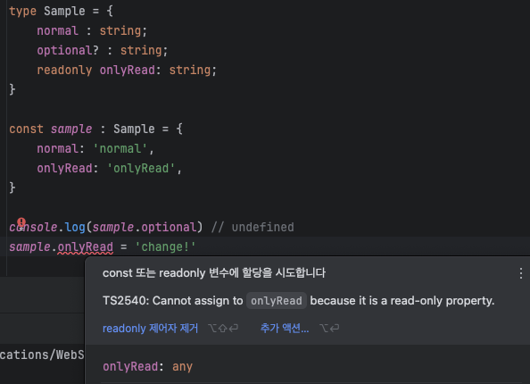

# 목차

> 1. `optional` & `readonly` (2.10 객체의 속성과 메서드에 적용되는 특징을 알자)
>
> 2. `리터럴 객체`와 `변수`에서의 타입검사 차이 
> 
> 3. 전개문법, 나머지속성 사용 (객체)
> 
> 4. 타입 연동 (인덱스 접근 타입)

# 📌 `optional` & `readonly`

`type`, `interface`와 무관하게 모두 `optional (?)`, `readonly`를 사용할 수 있다.

여기서 `optional`을 붙히면 있어도 그만 없어도 그만이라는 의미이고, `readonly`를 앞에 붙히면 해당 값을 조작할 수 없다는 것을 의미한다.



또 특이한점으론 `?`으로 `optional`처리를 하면 해당 key는 `undefined`를 value로 가짐을 허용한다.

# 📌 `리터럴 객체`와 `변수`에서의 타입검사 차이

둘은 타입을 검사할 때 차이가 있는데 정리하면 다음과 같다.

|         | 잉여속성검사(Excess Property Checking) |
|:-------:|:--------------------------------:|
| `리터럴객체` |                O                 |
|  `변수`   |                X                 |

여기서 잉여속성검사는 타입에서 선언하지 않는 속성을 사용한 경우 에러를 반환하는 것을 의미한다. 아래의 예시를 통해 확인해보자.

```ts
interface Money {
    amount: number;
    unit: string;
}

// const moneyErrorTest : Money = {amount: 200, unit: 'won', year: 1998} // year은 Money 타입에 존재하지 않는다는 에러
const objectVariableMoney = {amount: 200, unit: 'won', year: 2024};
const moneyErrorTest : Money = objectVariableMoney; // 에러가 발생하지 않음.

function addMoney(money1: Money, money2: Money) : Money {
    return {
        amount: money1.amount + money2.amount,
        unit: 'won'
    }
}

// addMoney(objectVariableMoney, {amount: 200, unit: 'won', year: 1998}) // year은 Money 타입에 존재하지 않는다는 에러
addMoney(objectVariableMoney, objectVariableMoney) // 에러가 발생하지 않음.
```

해당 코드에서 알 수 있듯 객체로 넣은 경우에만 에러가 발생했다. 이는 잉여속성검사가 발생했기 때문이다.

변수를 넣었을 때 오류가 발생하지 않은 이유는 잉여속성검사가 발생하지 않았기 때문도 맞지만 객체간 대입 가능성을 보기 때문이다.(2.13 참고)

# 📌 전개문법, 나머지속성 사용 (객체)

객체에서 전개문법과 나머지속성을 사용할 수 있다.

```ts
type rest1 = string
type rest2 = {
    a: string;
    b: number;
}

const { props: {rest1, ...rest2}} = {props: {rest1: 'hello', a: 'a', b: 1}}
```

명시적으로 사용하기 위해선 다음처럼 활용하면 된다.

```ts
const { props : {nested} } : { props : {nested : string}} = { props : {nested : 'hello'}};
console.log(nested) // 'hello'
```

# 📌 타입 연동

만약 특정 속성들을 서로 연동되도록 만들고 싶다면 다음과 같은 방법을 선택하면 된다.

```ts
type A = {
    name: string
    age: number;
}
type B = A['name']; // 인덱스 접근 타입
type C = Pick<A, 'name'>; // Pick
type D = {
    [key in keyof A] : string;
} // 매핑된 객체 타입 ... { name : string; age : string }
type E = {
    [key in keyof A] : A[key];
} // 매핑된 객체 타입 ... { name : string; age : number }
```

## 인덱스 접근 타입

배열과 객체 모두 **객체의 속성에 접근하듯** 인덱스 접근 타입을 구현할 수 있다.

```ts
// object
const obj = {
    a : '난a',
    b: '난b',
    c: 1,
};
type Keys = keyof typeof obj; // "a"|"b"|"c"
type Values = typeof obj[Keys] // string|number
type objTest1 = typeof obj['a'|'c'] // string | number
type objTest2 = typeof obj['a'|'b'] // string

// arr의 키 타입으론 인덱스와 배열 속성들이 존재한다.
type arrKeys = keyof [1,2,3]; // "length"|"toString"| ... |"0"|"1"|"2"
type arr = [1,2,3]
type arrLength = arr['length']; // 3
let testArr : arrKeys;
testArr = 5; // 모든 number은 배열의 key로 허용된다.
// testArr = "3"; // 인덱스 밖의 범위로 제한 
```

## 매핑된 객체 타입

반복문으로 타입 별칭을 선언한다고 생각하면 좀 더 이해하기 쉽다. 위에서 잠깐 다뤘던 예시를 가져와 보며 설명하도록 하겠다.

```ts
type A = {
    name: string
    age: number;
}

type D = {
    [key in keyof A] : string;
} // 매핑된 객체 타입 ... { name : string; age : string }
type E = {
    [key in keyof A] : A[key];
} // 매핑된 객체 타입 ... { name : string; age : number }
```

여기서 알 수 있는 것은 `key in` 뒤엔 유니온 형식으로 타입이 와야한다는 것이다.
이와 같은 문법은 배열, 튜플에서도 활용할 수 있다.

### 매핑된 객체 타입에서의 `readonly`, `?`
 
이와 같은 문법은 `readonly`, `?`를 활용 가능하다. 또한 기존에 작성되어있던 `readonly`, `?`을 제거하는 것 또한 가능하다.

```ts
interface A {
    readonly r1?: string;
    readonly r2?: number;
}

// optional과 readonly를 제거, Capitalize 활용하여 앞글자 대문자화
// R1 : string, R2 : number
type NoReadOnly = {
    -readonly [key in keyof A as Capitalize<key>]-?: A[key]
}

// 반대의 케이스라면 -를 빼고 적용하기.
```

# 💡결론

- 배열, 튜플 결국 객체처럼 속성값 찾듯 타입연동이 가능함을 학습했다.
- 리터럴 객체와 변수 할당 시 타입검사의 차이를 학습했다.
- 매핑된 객체를 활용하여 타입 조작이 가능함을 학습했다.
  - 타입스크립트를 다루는 많은 방법이 있음을 깨달았다.