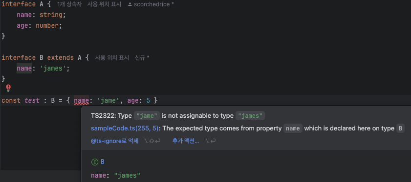

# 목차

> 2.11 타입을 집합으로 생각하자 (유니언, 인터섹션)
>
> 2.22 타입도 상속이 가능하다

# 📌 2.11 타입을 집합으로 생각하자.

타입별로 대입관계를 이해하기 위해선 타입을 집합으로 이해하는 것이 도움이 될 수 있다.

`|`은 합집합, `&`는 교집합 개념으로 이해하면 된다.

```ts
type stringAndnumber = string & number; // never
type stringOrnumber = string | number; // number, string 둘다가능
```

이 때 `unknown`은 전체집합, `never`은 공집합이라고 생각하자.

아무튼, 자신의 타입보다 큰 타입에 대입할 수 있다. `never`은 모든 타입에 대입 가능하고, `never`에는 그 어떤 타입도 대입할 수 없다.


## `any`를 조심하자.

`any`는 집합관계를 무시한다. 따라서 `any`와 `&`, `|`을 사용하는 것은 지양해야한다.

## 브랜딩

[제로초 유튜브 - 브랜딩](https://youtu.be/_mxnKmHMlpQ?si=NUlrlydCYxkvK6WM)

교재에서는 후순위에 다룬다고 작성이 되어있다. 흐름에 맞춰 후순위에 자세히 보도록하고, 무엇인지만 간략하게 알아보자.

다음과 같은 코드가 있다고 해보자.

```ts
const weight : number = 60
const length : number = 60

function showWeight(weight: number) {
    console.log(`Weight : ${weight}`)
}

showWeight(length)
showWeight(weight) // 둘다 동작하지만, 의도에 맞게 사용하기 위해 사용할 수 없을까?
```

`length`와 `weight` 모두 해당 함수에 활용 가능하다. 하지만 이를 구별하게 해주는 것이 브랜딩이다.

```ts
const weight : number & {__brand: 'lb'} = 60 as number & {__brand: 'lb'}
const length : number & {__brand: 'km'} = 60 as number & {__brand: 'cm'}

function showWeight(weight: number & {__brand: 'lb'}) {
    console.log(`Weight : ${weight}`)
}

showWeight(weight)
// showWeight(length) // error!
```

# 📌 2.22 타입도 상속이 가능하다

사실 이전에 관련된 내용을 다뤘다. 확인해보면 좋을 것 같다. 

[interface vs type](https://github.com/scorchedrice/my-type/blob/master/1%EC%A3%BC%EC%B0%A8/%ED%95%9C%EC%A7%80%EC%9B%85/%ED%95%9C%EC%A7%80%EC%9B%85-2.8-2.9.md)

위의 자료를 정리하면 상속은 `type`, `interface`에서 상호적으로 상속이 가능하며, `interface`에서는 선언적 확장이 가능하다는 것이다.

이번엔 위의 내용에서 추가적으로 상속받을 때 부모의 속성 타입을 변경하는 방법에 대해 다뤄보려한다.



위 캡처사진처럼 타입을 상속받을 때 변경할 수 있다. 물론, `string`인데 `number`로 완전 다른 타입으로 변경한다면 이는 에러를 반환한다.

# 💡결론

- 타입의 상속관계를 이해할 수 있는 챕터였다.
  - 타입을 집합으로 이해하는 것이 도움이 되었다. 