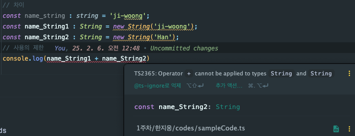
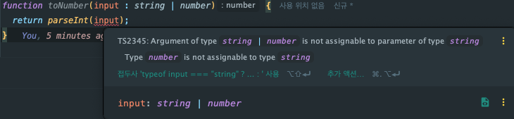

# 목차

> 2.5 타입으로 쓸 수 있는 것을 구분하자.
> 
> 2.6 타입스크립트의 자유도에 관하여 (유니언 타입으로 OR 관계를 표현하자.)

# 📌 2.5 타입으로 쓸 수 있는 것을 구분하자.

타입스크립트에서 대부분의 리터럴값은 타입으로 사용할 수 있다. 이와 더불어 `Math`, `Date`, `String`, `Number`, `Boolean`과 같은 내장 객체를 타입으로 사용할 수 있다.

하지만 `String`, `Number`, `Object`와 같은 내장 객체를 타입으로 사용하기보단 원시 자료형 타입인 `string`, `number` 등을 사용하는 것이 바람직하다.

## `String`과 `string`의 차이 (원시 타입을 사용해야하는 이유)

쉽게말해 `string`은 원시 문자열 타입을 나타낸다. 일반적으로 사용하는 `string`에 해당한다. 반면 `String`은 자바스크립트의 `String` <u>***객체***</u>를 의미한다.

결국 `String`은 래퍼 객체 타입(Wrapper Object Type)이기에 우리가 의도한 방향과 다르게 동작할 가능성이 있다.  



`Number`과 같은 내장 객체를 타입으로 선언하는 것도 이와 동일한 에러가 발생하기에 주의해야한다.

## `typeof`를 활용한 타입 선언

함수를 타입으로 활용하고 싶은 경우를 가정해보자.

```ts
function test(a: number, b: number) {
  return a+b;
}

const typeTest : typeof test = (x : number, y : number) => x+y;
```

## `class`로 새로운 객체를 생성하는 경우

이와 같은 경우엔 `typeof`와 같은 문법을 사용할 필요가 없다. 아래의 예시를 통해 확인해보자.

```ts
class Wizard {
  power : number;
  constructor(
    hp : number,
    mp : number,
    int : number,
    nickname : string
  ) {
    this.power = hp + mp + int;
  }
}

const myCharacter : Wizard = new Wizard(100, 350, 200, '초보자');
console.log(myCharacter); // Wizard { power: 650 }
```

# 📌 2.6 타입스크립트의 자유도에 관하여 (유니언 타입으로 OR 관계를 표현하자.)

앞에서 `|`으로 하나의 변수가 여러개의 타입을 가지는 경우 선언하는 방법에 대해 잠깐 다뤘다. 그렇다면 모든 경우에 이와 같은 선언방식이 유효할까?

일반적인 경우엔 이와 같은 선언이 유효하지만 다음과 같은 경우엔 타입스크립트가 에러를 반환한다.



위의 예시에서 `parseInt`를 활용했는데, 자바스크립트에선 `string`, `number`에 무관하게 동작하는 반면
타입스크립트에서는 `number`을 넣는 의미없는 행동을 제한합니다.

## 타입좁히기

위의 예시에서 다뤘던 코드처럼 자유도가 제한된 경우 `if`문을 활용하여 이를 해결할 수 있습니다. 이는 타입스크립트가 `if`문을 인식하여 타입을 좁혀가며 자연스럽게 타입을 추론하기 때문입니다.

```ts
function toNumber(input : string | number) {
  if (typeof input === 'string') {
    // if문에 걸렸으니 자연스럽게 string으로 추론
    return parseInt(input)
  }
  
  // if를 확인한 결과 아님이 판단되었으므로 number로 추론
  return input;
}
```

물론 모든 경우에 타입좁히기를 수행해야하는 것은 아닙니다. 

`toString()` 메서드의 경우 `Object.prototype`로부터 상속받은 것으로 모든 객체타입에 공통적으로 존재하는 메서드입니다. 즉, 모든 구성타입이 `toString()` 메서드를 가지고 있기에 이와 같은 경우엔 타입좁히기가 불필요합니다.
