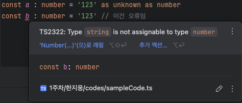
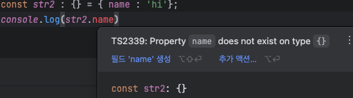

# 목차

> 2.7 타입스크립트에만 있는 타입을 배우자.

# 📌 2.7 타입스크립트에만 있는 타입을 배우자.

타입스크립트에는 `any`, `never`, `{}`, `void`, `unknown` 등 기존 자바스크립트에는 없는 타입들이 존재한다.

## `any`

타입스크립트를 사용하는 이유를 없애버리는 타입이다. **모든 타입을 허용한다**는 의미를 가진 타입이다.

`any`로 선언한 변수들 끼리 연산되는 경우 파생물 또한 `any`로 추론된다.

주로 타입을 선언하지 않은 경우, `ImplicitAny` 에러가 발생할 때 확인할 수 있다.

또, 교재에서는 이와같이 `any`를 <u>**타입 선언을 판단하는 척도**</u>로 해석하고있다. 즉, `any`로 추론되는 경우엔 타입이 선언되어야 한다는 것이다.

### `any`의 타입은 계속 바뀐다.

빈 배열을 선언한 경우 타입을 선언하지 않으면 `any[]`로 선언된다. 단, `push`되며 값이 추가되면 추론 값이 변화한다.

다음의 예시를 통해 확인하자.

```ts
const arr = []; // any[]
arr.push('1'); // string을 push, string[]
arr.push(2); // number을 push, (string | number)[]

// 이미 바뀌어버린 타입추론은 요소가 없어지더라도 변화하지 않는다.
arr.pop(); // (string | number)[]
```

또, `string`, `number`간 연산이 진행되는 경우 타입이 변화하기도한다.

```ts
const a: any = '123';

const an1 = a+1; // any
const nb1 = a-1;// number
const nb2 = a*1; // number;
const nb3 = a-1; // number
const st1 = a+'1' // string
```

### `any`로 추론되는 `JSON.parse`, `fetch`

`JSON.parse`와 `fetch`의 경우엔 `any`로 타입이 반환된다.

그렇기에 반환된 값들에 타입을 선언하여 모든 타입이 `any`가 되는 것을 방지해야한다.

```ts
fetch('url').then<{data:string}>((response) => {
    return response.json();
}).then((result) => {})

const result: {hello : string} = JSON.parse('{"hello":"json"}')
```

## `unknown`

`any`와 동일하게 모든 타입을 대입할 수 있다. 다른점은 대입한 이후 어떠한 동작도 할 수 없다는 것이다.

### try - catch 문에서 확인가능한 `unknown`

사실 `unknown`은 일반적인 경우 활용하지않는다. `unknown`은 try - catch 문법을 활용할 때 확인할 수 있다.

```ts
try {
    //  시도할 로직
} catch (e) {
    // e : unknown
    console.log(`error occured! : ${e.message}`)
}
```

위의 예시를 보면 `e`가 `unknown`으로 반환되었다. 즉, 그 이후 어떠한 동작도 할 수 없다는 것.

`e`에는 `any`와 `unknown`의 타입만을 선언할 수 있는데, `Error`와 같은 타입을 단언을 활용하여 부여할 수 있다.

```ts
try {
    //  시도할 로직
} catch (e) {
    // e : unknown
    const error = e as Error // error : Error
    console.log(`error occured! : ${error.message}`)
}
```

### `unknown`과 단언을 활용한 강제 타입 변환

사실 좋은 방법은 아니라고 생각한다. 아래의 예시로 이런것이 있다 정도만 알고 넘어가자.



## `!`연산자

해당 연산자는 `null`, `undefined`가 아니다는 것을 표시하는 연산자이다.

```ts
function a(param: string | null | undefined) {
    // param.slice(3); // 에러 반환 (null, undefined 가능성)
    param!.slice(3); // null, undefined일리 없다 표시하여 에러 없음.
}
```

## `void`

`void`는 함수에서 주로 사용되는 타입이며, 반환값이 없는 경우 타입스크립트는 함수를 `void`로 추론한다.

또, 반환값이 있는 경우에도 이를 사용할 수 있는데, <u>반환값의 타입을 무시하는</u> 특수한 기능을 가지고있어 반환값을 미리 작성하기 어려운 콜백함수 등에 활용한다.

```ts
const func: () => void = () => 3;
// const func1 = ():void => 3; // error : 반환값의 타입을 선언하는 경우 반환 타입을 무시X
// const func2: () => void | undefined = () => 3; // union으로 묶여있는 경우 무시X
```

단 항상 반환값의 타입을 무시하는 것은 아니다. 위의 예시처럼 반환값의 타입이 표기되는 경우, union으로 `void`외의 타입이 묶여있는 경우엔 반환값을 무시하지 않는다.

즉, 사용자가 함수 반환값을 사용하지 못하도록 제한하고, 반환값을 사용하지 않는 함수등에 활용하는 것이다.

## `{}`, `Object`, `object`

사실 가장 쓸 일 없는 타입들이다. 객체라는 이름을 가졌지만 해당 타입들로 선언된 변수를 사용하는 것이 불가능하기 때문이다.

`{}`, `Object`는 같은 타입이며, `null`, `undefined`를 제외한 모든 값을 말한다.



원시 자료값인 `object` 또한 위처럼 사용할 수 없다.

### `{}`와 `unknown`의 관계

쉽게 생각하면 `{}`에 `null`, `undefined`를 더한 것이 `unknown`이라고 생각하면 된다.

```ts
const unk : unknown = 'hello';
unk;

if (unk) {
    unk; // unk값이 있다면 => {}
} else {
    unk; // unk값이 없다 판단 => null or undefined가 포함된 unknown
}
```

## `never`

어떠한 타입도 대입할 수 없는 타입이다. 선언될 수 없는 경우, `throw`하는 **함수 표현식**, 무한 반복문이 존재하는 **함수 표현식**에서 `never` 타입이 선언된다.

### 선언될 수 없는 경우

타입스크립트는 `if`로 타입을 좁혀나갈 수 있다. 하지만 계속 좁혀나가도 해당 타입이 선언될 수 없는 경우, 즉 모순적인 타입선언이 예상된다면 `never`타입으로 추론된다.

```ts
function twoType(param : string | number) {
    if (typeof param === 'string') {
        console.log('string', param)
    } else if (typeof param === 'number') {
        console.log('number', param)
    } else {
        console.log('never', param) // string or number인데, 위에 조건문에서 다 걸러짐. 실행될 일이 없음.
    }
}
```

### 함수 선언문과 함수 표현문에서의 차이 (throw, infinite)

```ts
function throwFunc1() {
    throw new Error('error1')
}
const result1 : void = throwFunc1(); // 선언문(throw)

const throwFunc2 = () => { throw new Error('error2'); }
const result2 : never = throwFunc2(); // 표현문(throw)

function infFunc1() {
    while(true) {
        console.log('infinite')
    }
}
const result3 : void = infFunc1(); // 선언문(infinite)

const infFunc2 = () => { while(true) console.log('infinite') };
const result4 : never = infFunc2(); // 표현문(inifinite)
```

선언문에서는 타입이 `void`로 추론되므로 직접 `never`을 적어 이를 해결할 수 있다.

### `never`을 보는 경우

타입스크립트의 설정 값에따라 `never`을 배열에서 보는 경우가 존재한다.

빈 배열을 선언할 때 보는 `any[]`의 경우 `TS Config`에서 `noImplicitAny` 설정이 해제된 경우 `never[]`로 변환된다.

즉, 이렇게되면 배열을 사용할 수 없게되므로 직접 타입을 입력해줘야한다. (`number[]`, `string[]` ...)

# 💡결론

- 타입스크립트에만 존재하는 여러가지 타입에 관련된 내용을 학습했다.
  - 같은 **함수**여도 선언식이냐, 표현식이냐에 따라 타입 추론이 달라질 수 있다.