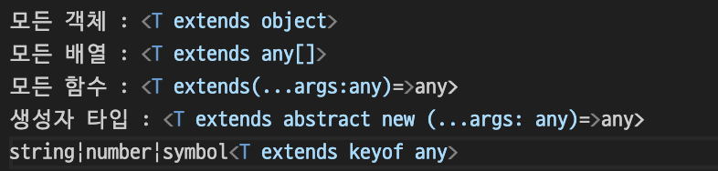

# 2.13 객체 간에 대입할 수 있는지 확인하는 법을 배우자

```js
interface A {
  name: string;
}
const bObj = {
  name: "zero",
  age: 32,
};
const bToA: A = bObj;
// -> A에는 정의된 age가 없는데 오류가 나지 않음

interface B {
  name: string;
  age: number;
}
const aObj = {
  name: "zero",
};
const aToB: B = aObj;
// -> B에는 age가 정의되어있는데 이를 쓰지 않았더니 오류가 발생
```

A ⊃ B 는 가능하지만 A ⊂ B는 불가능하다

❓ 왜

✅ 넓은 타입은 좁은 타입에 대입할 수 없기 때문이다. 좁은 -> 넓은으로는 대입이 가능하다.

좁은 타입 vs 넓은 타입

-

```ts
interface A {
  name: string;
} // ->  넓다

interface B {
  name: string;
  age: number;
} //-> 좁다
```

A타입이 B타입보다 넓은(=추상적인) 타입이다.

> 📝 어떤 타입이 더 넓은지 헷갈린다면 속성이 많을수록 더 좁은 타입라고 생각하면 된다. 조건이 더 많다는 것은 구체적이라는 의미이므로 더 좁은 타입이다.

|(유니온), &(인터섹션)의 대입 가능성을 확인해보자

-

```ts
interface A {
    name: string;
}
interface B {
    age: number;
}
function test (): A | B {
    if (Math.random() > 0.5) {
        return {
            age: 28,
        };
    }
    return {
        name: "zero",
    };
}
const target1 : A & B =test(); ❌
const target2: A = test(); ❌
const target3: B = test(); ❌
```

❓ 왜 오류가 발생할까?

✅ target1은 A, B 타입을 모두 가져아한다. 하지만 test()는 A, B 중 하나만 가질 수 있기 때문에 오류가 난다.
target2와 target3은 확정적으로 직접 타입을 할당하기 때문에 오류가 난다.

## 튜플, 배열의 대입 가능성을 확인해보자

- 튜플: 배열보다 더 엄격한 타입을 가진다. 길이와 각 위치의 타입을 고정한다.

- 배열: 같은 타입의 요소를 여러 개 저장할 수 있는 자료 구조

❗️ 튜플은 배열보다 좁은(=제한적인) 타입이다. 고로 (배열->튜플) 튜플을 배열에 넣을 수 있지만 (배열->튜플) 배열을 튜플에 넣을 수는 없다.

```ts
let a: ["hi", "readonly"] = ["hi", "readonly"]; // 튜플
let b: string[] = a; // ⭕️ 튜플을 배열에 넣을 수 있음

let b: string[] = ["hi", "normal"];
let a: ["hi", "readonly"] = b; // ❌ 배열을 튜플에 넣을 수 없음
```

- 배열,튜플에 readonly 수식어를 붙일 수 있다. readonly 수식어가 붙은 배열이 더 넓은 타입이다.

1. readonly 배열 vs 배열

```ts
let a: readonly string[] = ["read", "only"];
let b: string[] = ["read", "only"];
// b를 a에 대입할 수 있지만 a를 b에 대입할 수 없다. (stirng[]이 readonly string[]보다 더 좁은 타입임)
```

2.  readonly 튜플 vs 배열

```ts
let a: readonly ["read", "only"] = ["read", "only"];
let b: string[] = ["hi", "world"];

a = b; // ❌ 배열이 튜플보다 더 넓은 타입이므로 대입 불가
b = a; // ❌ readonly가 붙는다면 일반 배열보다 넓은 타입이므로 대입 불가, 하지만 readonly가 붙어서 안되는 것이 아닌 원래 튜플은 배열보다 좁은 타입이기때문에 대입 불가
// 둘 다 서로 대입하지 못한다.
```

3. readonly 튜플 vs readonly 배열

```ts
let a: readonly string[] = ["read", "only"];
let b: readonly [string, number] = ["hi", 123];

a = b; // ❌  튜플이 배열보다 좁기 때문에 할당 불가
b = a; // ⭕️ 배열이 튜플보다 넓기 때문에 할당 가능
```

## 옵셔널 속성의 대입 가능성을 알아보자

속성이 옵셔널인 객체가 옵셔널이지 않은 객체보다 넓은 타입이다. 옵셔널이란 옵션이라고 생각하면 되는데 옵션이 있는 것이 더 선택지가 많다고 생각할 수 있으므로 속성이 옵셔널이지 않은 객체보다 옵셔널인 객체가 더 넓은 타입이다.

```ts
type Optional ={
    a?:string;
    b?:string;
}
type NoOptional ={
    a:string;
    b:string;
}
const o: Optional ={
    a: 'hello';
}
const n: NoOptional ={
    a:'hello',
    b:'world',
}
const o2: Optional =n;
const n2: NoOptional =o; // ❌ 옵셔널 속성(b?)이 빠진 경우를 커버하지 못해서 오류가 난다.
```

## readonly 속성이 있는 객체와 없는 객체 간의 대입 가능 여부에 대해 알아보자

readonly가 붙어도 서로 대입 가능하다.

```ts
type ReadOnly ={
    readonly a:string;
    readonly b:string;
}
type NoReadOnly ={
    a:string;
    b:string;
}
const o: ReadOnly ={
    a: 'hello';
    b: 'bye';
}
const n: NoReadOnly ={
    a:'hello',
    b:'bye',
}
const o2: ReadOnly=n;
const n2: NoOReadOnly =o;
```

## 구조적 타이핑

모든 속성이 동일하면 객체 타입의 이름이 다르더라도 동일한 타입으로 취급한다.

```ts
interface Student {
  id: number;
  name: string;
}
interface Teacher {
  id: number;
  name: string;
}
const student: Teacher = { id: 1, name: "heeyoung" };
const a: Student = teacher;
```

두 인터페이스 모두 number인 Id, string인 name을 가지고 있다. 이처럼 구조가 같으면 같은 객체로 인식하는 것을 <span style="color:#ffd33d">구조적 타이핑</span>이라고 한다.

```ts
interface A {
  name: string;
}
interface B {
  name: string;
  age: number;
}
```

B는 A의 속성을 모두 가지고 있으므로 구조적 타이핑 관점에서 B인터페이스는 A인터페이스라고 볼 수 있다. 하지만 A에는 age속성이 없으므로 A인터페이스는 B인터페이스라고 볼 수 없다.

```ts
type Arr = number[]; //ex) [1,3,9] type: number
type CopyArr = {
  [Key in keyof Arr]: Arr[key];
};
// ex) keyof Arr -> 배열의 인덱스, Arr[Key] -> 각 키에 해당하는 값의 타입 즉, number, CopyArr -> { 0: number, 1: number, 2: number, ... }
const copyArr: CopyArr = [1, 3, 9];
```

CopyArr와 Arr의 속성이 같으므로 둘은 구조적으로 동일하다.

❓ 왜?

✅ 배열도 객체이기 때문에 key가 존재한다. (인덱스 , 배열의 내장 속성(length,push,pop 등))

```ts
type SimpleArr = { [key: number]: number; length: number };
// key의 타입은 넘버, length의 타입은 넘버(배열은 기본적으로 length라는 속성을 가지고 있다.)
const simpleArr: SimpleArr = [1, 2, 3];
```

[1,2,3]과 {[key:number]:number,length:number}는 동일한 속성이라고 볼 수 있으므로 대입이 가능하다.

❓ 대입을 불가능하게 하려면 어떻게 해야할까

✅ 속성을 추가하여 구조적으로 동일하지 않게 해야한다.

```ts
interface Student {
  _type: "student";
  id: number;
  name: string;
}
interface Teacher {
  _type: "teacher";
  id: number;
  name: string;
}
const student: Student = { id: 1, name: "heeyoung", type: "student" }; // ⭕️
const a: Student = teacher; // ❌ _type이 다르므로 대입 불가능하다.

// 속성이 겹치지 않는 이름(_type)은 브랜드 속성이라고 부른다. 그리고 이를 사용하는 것을 브랜딩이라고 한다.
```

# 2.14 제네릭으로 타입을 함수처럼 사용하자

- 자바스크립트에서의 중복 제거하는 법
  - 공통된 속성을 하나로 묶는 함수를 만들어 중복을 제거한다.

```js
const person1 = {
  type: "human",
  food: "pizza",
  name: "heeyoung",
  age: 26,
};
const person2 = {
  type: "human",
  food: "pizza",
  name: "zeus",
  age: 22,
};
// 중복제거
const personFactory = (name, age) => ({
  type: "human",
  food: "pizza",
  name,
  age,
});
const person1 = personFactory("heeyoung", 26);
const person1 = personFactory("zero", 22);
```

- 타입스크립트에서의 중복 제거하는 법
  - 제네릭을 사용해서 중복을 제거한다.
  - 타입 매개변수의 개수와 타입 인수의 개수가 일치해야한다.
  - 제네릭을 가질 수 있는 것 : 인터페이스, 클래스, 타입 별칭, 함수

```ts
//인터페이스
interface person1 = {
    type: 'human',
    food:'pizza',
    name: 'heeyoung',
    age:26
}
interface person2 = {
    type: 'human',
    food:'pizza',
    name: 'zero',
    age:22
}
interface Person<N,A>{
    type:'human',
    food:'pizza',
    name:N,
    age:A
}
interface Heeyoung extends Person<'heeyoung',26>{}
interface Zero extends Person<'zero',22>{}

interface Heeyoung extends Person<'heeyoung'>{} // ❌ 타입 인수가 일치하지 않아서 오류 발생
interface Zero extends Person<'zero',22,'good'>  // ❌ 타입 인수가 일치하지 않아서 오류 발생
//타입
type Person<N,A>= {
    type:'human',
    food:'pizza',
    name:N,
    age:A,
}

type Heeyoung =Person<'heeyoung',26>;
type Zero =Person<'zero',22>;

//클래스
class Person<N,A>{
    name:N;
    age:A;
    constructor(name:N,age:A){
        this.name=name;
        this.age=age;
    }
}

//함수 표현식
const newPerson = <N,A>(name: N, age: A): Person<N,A>=>({
    type: 'human',
    food: 'pizza',
    name,
    age
})

//함수 선언문
function newPerson<N,A>(name:N,age:A){
    return({
    type: 'human',
    food: 'pizza',
    name,
    age
    })
}
```

- interface와 type간에 교차 사용도 가능하다.

```ts
interface IPerson<N, A> {
  type: "human";
  food: "pizza";
  name: N;
  age: A;
}
type TPerson<N, A> = {
  type: "human";
  food: "pizza";
  name: N;
  age: A;
};

type Heeyoung = IPerson<"heeyoung", 26>;
interface Zero extends TPerson<"zero", 26> {}
```

> 📝 제네릭 사용 방법
>
> interface 이름<타입 매개변수들> {...}
>
> type 이름<타입 매개변수들> = {...}
>
> class 이름<타입 매개변수들> {...}
>
> function 이름<타입 매개변수들> (...) {...}
>
> const 함수이름 =<타입 매개변수들> (...) => {...}

- 타입 매개변수는 기본값(default)을 사용할 수 있다.

기본값으로 정의된 타입은 후에 덮어쓰기가 가능하다. Person2는 N의 타입이 number로 정의되었기 때문에 기본값인 string에서 number로 덮어씌워진다. A는 정의되지 않았기 때문에 기본 값인 number가 된다.
Person3은 number,boolean으로 정의되었기 때문에 기본값인 string, number에서 number,boolean으로 덮어씌워진다.

```ts
interface IPerson<N = string, A = number> {
  type: "human";
  food: "pizza";
  name: N;
  age: A;
}
type Person1 = Person;
type Person2 = Person<number>;
type Person3 = Person<number, boolean>;
```

- 제네릭에 타입을 직접 넣지 않아도 추론이 가능하다.

```ts
interface IPerson<N, A> {
  type: "human";
  food: "pizza";
  name: N;
  age: A;
}

const CPerson = <N, A = unknown>(name: N, age: A): Person<N, A> => ({
  type: "human",
  food: "pizza",
  name: N,
  age: A,
});

const zero = CPerson("zero", 22);
```

- 상수 타입 매개변수 (타입스크립트 5.0버전)

```ts
function values<T>(initial: T[]) {
  return {
    hasValue(value: T) {
      return initial.includes(value);
    },
  };
}

const savedValues = values(["a", "b", "c"]);
savedValues.hasValues("x");
// T ->['a','b','c'] 이므로 string으로 추론된다.
```

- string으로 추론되지않고 a | b | c 로 추론되게 하고 싶다면 타입 매개변수 앞에 const 수식어를 붙이면 된다.

```ts
function values<const T>(initial: T[]) {
  return {
    hasValue(value: T) {
      return initial.includes(values);
    },
  };
}
const savedValues = values(["a", "b", "c"]);
savedValues.hasValue("x"); // ❌ a,b,c가 아니므로 오류 발생
```

## 제네릭에 제약 걸기

타입 매개변수에는 제약(constraint)을 사용할 수 있다.

사용법 : extends

❗️ 타입의 상속을 의미하는 extends와 다르다.

```ts
interface Example<A extends number, B=string>{
    a:A,
    b:B,
}
// -> A의 타입은 무조건 number여야 한다.
type Case1 = Example<string, boolean>; ❌
type Case2 = Example<1, boolean>; ⭕️
type Case3 = Example<number>; ⭕️
```

```ts
interface Example<A,B extends A>{
    a:A,
    b:B,
}
// -> B 타입은 A 타입이여야 한다.
type Case1 = Example<string, boolean>; ❌
type Case2 = Example<string, 'hello'>; ⭕️
type Case3 = Example<number,123>; ⭕️
```

> 📝 제약 extends 사용법
>
> 

- 타입 매개변수와 제약을 동일하게 생각하면 안된다.

```ts
interface V {
  value: any;
}
const returnV = <T extends V>(): T => {
  return { value: "test" };
}; // ❌ 오류 발생
```

❓ {value: 'test'}는 value:any를 만족하는데 왜 오류가 날까?

✅ {value:string, another:string} 일 수도 있기 때문에 에러가 발생한다.

```ts
function onlyBoolean<T extends boolean>(arg: T = false): T {
  return arg;
}
// ❌ 오류 발생
```

❓ T는 boolean인데 왜 기본값으로 넣으니 오류가 나지?

✅ T가 never일 수도 있으므로 false, true를 기본값으로 넣으면 오류가 난다.

# 2.15 조건문과 비슷한 컨디셔널 타입이 있다.

컨디셔널 타입이란 조건에 따라 다른 타입이 되는 것이다. 중첩해서 사용 가능하다.

사용법 : **특정 타입 extends 다른 타입 ? 참일 때 타입 : 거짓일 때 타입**

```ts
type A1 = string;
type B1 = A1 extends string ? number : boolean;

type A2 = number;
type B2 = A2 extends string ? number : boolean;
```

여기서의 extends는 삼항연산자처럼 사용된다. 쉽게 `A1 = string ? number : boolean;
A2 = string ? number : boolean;` 라고 바꿔 생각하면 편한데, A1이 string이면 B1은 number, 아니면 boolean이다.
A2의 타입은 string아니므로 B2는 boolean이 된다.

## 컨디셔널 타입을 활용한 타입 검사

삼항연산자처럼 걸러지기 때문에 컨디셔널 타입을 활용해서 타입을 검사할 수 있다.

```ts
type One = "hi" extends string ? true : false;
// true
type Two = [1] extends [string] ? true : false;
// false
```

## 컨디셔널 타입 + never

- 제네릭과 함께 많이 사용된다.

```ts
type ChooseArray<A> = A extends string ? string[] : never;
type StringArray = ChooseArray<string>; // string[]
type Never = ChooseArray<number>; // never
```

- never은 모든 타입에 대입이 가능하므로 모든 타입을 extends할 수 있다.

```ts
type Result = never extends string ? true : false; // true
```

- key가 never이면 속성이 제거된다

```ts
type OmitByType<O, T> = {
  [K in keyof O as O[k] extends T ? never : K]: O[K];
};
type Result = OmitByType<
  {
    name: string;
    age: number;
    married: boolean;
    rich: boolean;
  },
  boolean
>;
// O[k] extends T ? never : K 에서 속성의 타입이 T 이면 never가 된다. 여기서 T는 boolean이므로 boolean이 제거되어 name, age만 남는다.
```

## 컨디셔널 타입 분배법칙

컨디셔널 타입은 유니온 타입(|)이 올 경우 분배된다.
즉, T extends U ? X : Y 형태에서 T가 유니온 타입이면 개별적으로 평가된다.

```ts
type A = string | number;
type B = A extends string ? A[] : never; // B는 never타입이다.
```

A에 string이 있으므로 A[] 타입이 되어야한다고 예상하지만 결과는 never타입으로 정의된다.

❓`(string extends string ? string[] : never) 
| (number extends string ? number[] : never)` 로 분배 되어 결과 값은 `string[] | never`이렇게 나오게 되고 never은 제거되므로 `B = string[]`가 되어야하는거 아닌가?

✅ A[] 는 string[], number[]이 아닌 **(string | number)[]** 이기 때문에 never로 정의되는 것이다.

❓ string[] 을 얻고싶다면?

✅ 제네릭을 활용하면 된다.

```ts
type A = string | number;
type WrapIfString<T> = T extends string ? T[] : never;
let B: WrapIfString<A> = ["hi"]; // string[]
```

---

분배법칙이 일어나지 않도록 조심해야하는 경우가 있다.

```ts
type IsString<T> = T extends string ? true : false;
type Result = IsString<"hi" | 3>;
```

실행과정을 살펴보면 아래와 같다.

1. IsString<'hi'> | IsString<3>
2. ('hi' extends string ? true : false) | (3 extends string ? true : false)
3. true | false
4. boolean 타입 도출

분배법칙이 일어나지 않도록 막는 방법은 **배열을 제네릭으로 감싸는 것**이다.

```ts
type IsString1<T> = T extends string ? true : false;
type IsString2<T> = [T] extends [string] ? true : false; // 배열을 제네릭으로 감싼다.

type Result1 = IsString1<"hi" | 3>; // boolean
type Result2 = IsString2<"hi" | 3>; // false
```

---

never도 분배 법칙의 대상이다. never은 유니언이 아니기 때문에 분배 법칙의 대상이 아니라 의문을 가질 수 있지만 예외적으로 유니언이라고 생각하면 된다.

```ts
type A<T> = T extends string ? true : false;
type AA = A<never>;
```

❓ never은 모든 타입을 extends할 수 있다고 했으므로 true가 나와야한다고 생각하지만 결과값은 never이다 왜일까?

✅ never는 유니온 타입에서 **아무것도 없는 상태(=공집합)** 를 의미하므로, 평가할 값이 없어서 전체 결과가 never이 된다.

# 2.16 함수와 메서드를 타이핑하자.

1️⃣ 나머지 문법

나머지 매개변수 문법을 사용하는데에는 두가지 유의사항이 있다.

1. 매개변수는 항상 배열이나 튜플 타입이어야한다.
2. 나머지 매개변수 문법은 매개변수의 마지막 자리에만 위치해야 한다.

```ts
const example = (a: string, ...b: number[]) => {};
example("hi", 1, 2, 3, 45);

const errorExample = (...a: string[], b: number) => {}; // ❌ 나머지 매개변수 문법은 매개변수의 마지막 자리에만 위치해야한다.
```

2️⃣ 전개 문법

```ts
const example = (...args: [number, string, boolean]) => {};
example(1, "hi", true);
//-> const example: (args_0: number, args_1: string, args_2: boolean) => void
```

3️⃣ this

#### 함수 내부에서 this를 사용하는 경우

---

매개변수 **첫번째 자리**에 명시적으로 표기해야한다. 그렇지 않으면 오류가 발생한다. 명시했다고 바로 사용할 수 있는 것은 아니다. 호출할 때 .call() 를 사용해야한다.

```ts
function example(this: Window) {
  console.log(this);
} // ⭕️ this: Window

example.call(window);

const example = (this: Window) => {
  console.log(this);
}; // ❌ 화살표 함수에서는 this를 지정할 수 없음
```

❓ 화살표 함수에서 this를 쓰고 싶다면?

✅ bind()를 활용하면 된다.

```ts
const example = function (this: Window) {
  console.log(this);
}.bind(window);
```

#### 메서드에서 this를 사용하는 경우

---

this가 바뀔 수 있을 때는 명시적으로 타이핑해야한다.

```ts
type Animal = {
  age: number;
  type: "dog";
};
const person = {
  name: "zero",
  age: 26,
  sayName() {
    this;
    // this: {
    // name: string;
    // age: number;
    // sayName(): void;
    // sayAge(this: Animal): void;}
    this.name;
  },
  sayAge(this: Animal) {
    this;
    // this: Animal
    this.type;
  },
};
person.sayAge.bind({ age: 3, type: "dog" });
```

---

4️⃣ class

자바스크립트에서는 함수를 생성자(constructor)로 사용할 수 있었지만 타입스크립트에서는 불가능하다. 대신, class를 사용해서 객체를 생성해야 한다.

```ts
class Person {
  name: string;
  age: number;
  married: boolean;
  constructor(name: string, age: number, married: boolean) {
    this.name = name;
    this.age = age;
    this.married = married;
  }
  sayName() {
    console.log(this.name);
  }
}
const zero = new Person("zero", 28, false);
```

# 2.17 같은 이름의 함수를 여러 번 선언할 수 있다.

타입스크립트에서는 매개변수에 어떤 타입과 값이 들어올지 미리 타입을 선언해야한다.

## 오버로딩

> 두 문자열을 합치거나, 두 숫자를 더하는 함수를 만들고 싶다.
>
> 문자열 + 숫자는 원하지 않는다.
>
> ```ts
> function add2(x: string | number, y: string | number): string | number {
>   return x + y;
> }
>
> add("1", 2); // ⭕️ 원하지 않는데 됨
> add(1, "2"); // ⭕️ 원하지 않는데 됨
> ```
>
> ✅ 오버로딩을 사용한다.

❗️오버로딩은 화살표함수에서 작동하지 않는다.

```ts
function add(x: number, y: number): number;
function add(x: string, y: string): string;

function add(x: any, y: any): number | string {
  return x + y;
}

console.log(add(10, 20)); // 30
console.log(add("Hello", " World")); // "Hello World"
```

#### 선언의 순서

---

'HI'는 string이므로 첫번째와 두번째 모두 해당한다. 하지만 먼저 선언된 오버로딩에 해당하므로 타입은 string으로 반환된다.

```ts
function example(param: string): string;
function example(param: string | null): number;
function example(param: string | null): string | number {
  if (param) {
    if (param) {
      return "string";
    } else {
      return 123;
    }
  }
}

const result = example("HI"); // const result: string
```

#### 인터페이스와 타입 별칭 오버로딩 표현

---

```ts
//인터페이스
interface Add {
  (x: number, y: number): number;
  (x: string, y: string): string;
}
const add: Add = (x: any, y: any) => x + y;

//타입 별칭
type Add1 = (x: number, y: number) => number;
type Add2 = (x: string, y: string) => string;
type Add = Add1 & Add2;
const add: Add = (x: any, b: any) => x + y;
```

# 2.18 콜백 함수의 매개변수는 생략 가능하다.

```ts
function example(
  callback: (error: Error | null, result: string | number) => void
) {}
//콜백 함수의 매개변수는 error, result가 있고 각각 Error, (string|number)타입이다.

example((err, res) => {
  if (err) {
    console.error("오류:", err.message);
    return;
  }
  console.log("결과:", res);
});
```

❓타입을 표기하지 않았는데 에러가 나지 않는다.

✅ 문맥적 추론 현상으로 콜백 함수에 대한 타입을 표기했기 때문에 콜백 매개변수의 타입으로 추론된다.
