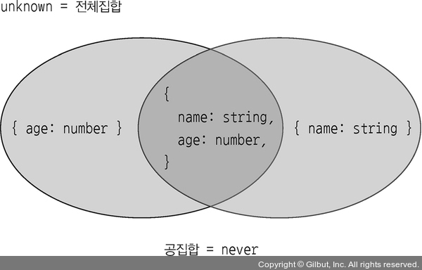

## 2.13 객체 간에 대입할 수 있는지 확인하는 법을 배우자

```ts
interface A {
  name: string;
}
interface B {
  name: string;
  age: number;
}

const aObj = {
  name: "zero",
};
const bObj = {
  name: "nero",
  age: 32,
};
const aToA: A = aObj;
const bToA: A = bObj;
const aToB: B = aObj; // Property 'age' is missing in type '{ name: string; }' but required in type 'B'.
const bTob: B = bObj;
```

- 위의 예시에서 A 타입에 B 타입 객체를 대입하는 것은 가능하지만 B 타입에서 A타입 객체를 대입하는거는 불가능함.
- 객체는 구체적인 타입일수록 더 좁은 타입임.
  

```ts
interface A {
  name: string;
}
interface B {
  age: number;
}

function test(): A | B {
  if (Math.random() > 0.5) {
    return {
      age: 28,
    };
  }

  return {
    name: "zero",
  };
}
const target1: A & B = test();
// Type 'A | B' is not assignable to type 'A & B'
const target2: A = test();
// Type 'A | B' is not assignable to type 'A'
const target3: B = test();
// Type 'A | B' is not assignable to type 'B'
```

- 튜플은 배열보다 좁은 타입: 튜플은 배열에 대입할 수 있으나 배열은 튜플에 대입할 수 없음.

```ts
let a: ["hi", "readonly"] = ["hi", "readonly"];
let b: string[] = ["hi", "normal"];

a = b; // Type 'string[]' is not assignable to type '["hi", "readonly"]'. Target requires 2 element(s) but source may have fewer.
b = a;
```

- 배열이나 튜플이나 readonly 수식어 붙일 수 있는데 readonly 수식어가 붙은 배열이 더 넓은 타입임.

```ts
let a: readonly string[] = ["hi", "readonly"];
let b: string[] = ["hi", "normal"];

a = b;
b = a;
// The type 'readonly ["hi", "readonly"]' is 'readonly' and cannot be assigned to the mutable type 'string[]'.
```

- 그런데 readonly 튜플과 일반 배열은 서로 대입이 안됨.
  - 배열을 튜플에 대입하려는 a = b의 경우, 배열이 튜플보다 넓은 타입이므로 에러가 발생
  - 튜플을 배열에 대입하려는 b = a의 경우, 튜플이 배열보다 좁은 타입인 것은 맞으나 readonly 수식어가 붙는다면 일반 배열보다 넓은 타입이므로 대입불가능

```ts
let a: readonly ["hi", "readonly"] = ["hi", "readonly"];
let b: string[] = ["hi", "normal"];

a = b;
// Type 'string[]' is not assignable to type 'readonly ["hi", "readonly"]'. Target requires 2 element(s) but source may have fewer.
b = a;
// The type 'readonly string[]' is 'readonly' and cannot be assigned to the mutable type 'string[]'.
```

- 옵셔널인 객체가 옵셔널이지 않은 객체보다 더 넓은 타입임. 옵셔널이란 기존 타입에 undefined가 유니언된 것과 같기 때문임.

```ts
type Optional = {
  a?: string;
  b?: string;
};
type Mandatory = {
  a: string;
  b: string;
};
const o: Optional = {
  a: "hello",
};
const m: Mandatory = {
  a: "hello",
  b: "world",
};
const o2: Optional = m;
const m2: Mandatory = o;
// Type 'Optional' is not assignable to type 'Mandatory'. Types of property 'a' are incompatible. Type 'string | undefined' is not assignable to type 'string'. Type 'undefined' is not assignable to type 'string'.
```

- 배열과 다르게 객체에서는 속성에 readonly가 붙어도 서로 대입할 수 있음.

```ts
type ReadOnly = {
  readonly a: string;
  readonly b: string;
};
type Mandatory = {
  a: string;
  b: string;
};
const o: ReadOnly = {
  a: "hi",
  b: "world",
};
const m: Mandatory = {
  a: "hello",
  b: "world",
};
const o2: ReadOnly = m;
const m2: Mandatory = o;
```

- 객체는 모든 속성이 동일하면 객체 타입의 이름이 다르더라도 동일한 타입으로 취급함. => 객체를 어떻게 만들었든 간에 구조가 같으면 같은 객체로 인식하는 것을 구조적 타이핑(structural typing) 이라 부름.

```ts
interface Money {
  amount: number;
  unit: string;
}

interface Liter {
  amount: number;
  unit: string;
}

const liter: Liter = { amount: 1, unit: "liter" };
const circle: Money = liter;
```

### 구조적 타이핑

- 타입스크립트에서는 모든 속성이 동일하면 객체 타입의 이름이 다르더라도 동일한 타입으로 취급함.
- 객체를 어떻게 만들었든 간에 구조가 같으면 같은 객체로 인식하는것을 구조적 타이핑이라고 함.

```ts
interface Money {
  amount: number;
  unit: string;
}

interface Liter {
  amount: number;
  unit: string;
}

const liter: Liter = { amount: 1, unit: "liter" };
const circle: Money = liter;
```

- 배열에 매핑된 객체 타입이 적용된 경우에도 구조적 타이핑 특성이 나타남.

```ts
type Arr = number[];
type CopyArr = {
  [Key in keyof Arr]: Arr[Key];
};

const copyArr: CopyArr = [1, 3, 9]; // CopyArr은 객체 타입인데도 숫자 배열을 대입할 가능
// CopyArr 타입에 존재하는 모든 속성을 숫자 배열이 갖고 있으므로 둘은 구조적으로 동일한 셈

type SimpleArr = { [key: number]: number; length: number };
const simpleArr: SimpleArr = [1, 2, 3]; // 이것도 구조적 타이핑 가능
```

- 구조적으로 동일하지 않게 하기 위해서 일부로 다른 속성을 추가할 수 있다. 속성의 이름은 아무거나 가능함.

```ts
interface Money {
  __type: "money";
  amount: number;
  unit: string;
}

interface Liter {
  __type: "liter";
  amount: number;
  unit: string;
}

const liter: Liter = { amount: 1, unit: "liter", __type: "liter" };
const circle: Money = liter; //__type 속성이 다르므로 대입되지 않음
// Type 'Liter' is not assignable to type 'Money'. Types of property '__type' are incompatible. Type '"liter"' is not assignable to type '"money"'.
```

## 결론

- 넓은 타입에서 좁은 타입으로 대입 불가능. 좁은 타입은 넓은 타입에 대입 가능
- 넓은 타입, 좁은 타입만 구분할 수 있다면 누가 누구에게 대입할 수 있는지 없는지를 쉽게 판단가능함
