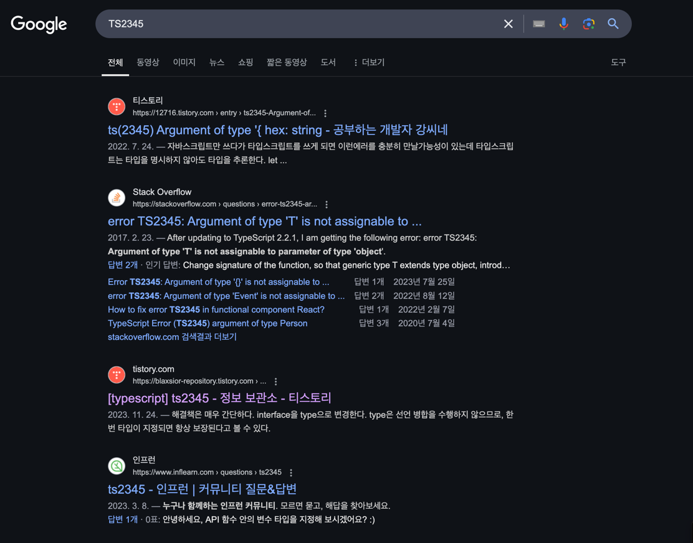

# 타입스크립트의 에러 코드로 검색하자 

### 구글링
- 에러메세지 뒤에 붙은 숫자에 TS를 붙여 구글링하면(TS2345) 해결 방법이 나온다.
```ts
const arr1: string[]= ['1','2','3']
const arr2: Array<number>= [1,2,3]
arr1.push(4); 
// ❌ Argument of type 'number' is not assignable to parameter of type 'string'.(2345)
```


### 에러 정리 사이트
- https://typescript.tv/errors/