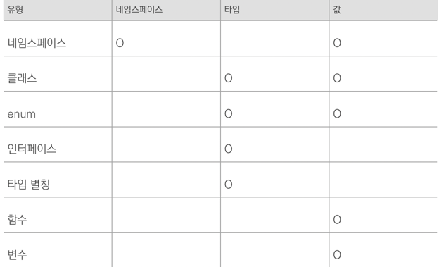
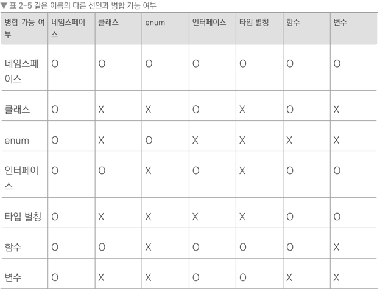

# 2.32 앰비언트 선언도 선언 병합이 된다.
- 타입스크립트에서 남의 라이브러리를 사용할 때 그 라이브러리가 자바스크립트라면 직접 타이핑해야하는 경우가 생긴다. 이때 앰비언트 선언을 사용한다.
- 함수, 변수, 네임스페이스, 클래스 등이 외부에서 정의되어 있음을 컴파일러에게 알리는 역할이다.
- 구현부가 없어도 값처럼 사용할 수 있다(new C,func(variable)). 외부 파일에 실제 값이 존재한다고 믿기 때문이다.
- 외부 파일에 값이 없으면 오류가 발생한다.
- 문법: declare 예약어


```ts
declare namespace NS {
    const a: string;
};
declare enum Enum {
    ADMIN = 1
}
declare const variable: string;
declare function func1(param: number): string; 
declare class C {
    constructor(p1:string,p2:string);
}  
new C(func1(variable),NS.a)
```
선언이 생성하는 객체
-


- 네임스페이스로 선언한 것은 네임스페이스면서 값으로 사용된다.
- 클래스와 enum 는 타입, 값으로 사용할 수 있다.
- 타입 별칭과 인터페이스는 타입으로만 사용 가능하다.
- 함수와 변수는 값으로만 사용 가능하다.

선언병합
- 
- 인터페이스, 네임스페이스는 같은 이름으로 여러개 존재할 때 병합되고 여러번 선언할 수 있다.



```ts
 declare class A {
    constructor(name: string);
}

function A(name: string) {
    return new A(name);
}

new A("hee");
A("hee");    
// A()를 호출하면 내부적으로 new A()를 실행한다. 
// 고로, 사용자는 new를 붙이지 않고도 A()로 객체를 쉽게 만들 수 있음
``` 
```ts
function Ex() { return 'hello'; }
namespace Ex {
  export const a = 'world';
  export type B = number;
}
Ex(); // hello
Ex.a; // world
const b: Ex.B = 123;
// 함수와 네임스페이스가 병합될 수 있으므로 오류가 나지 않는다.
```