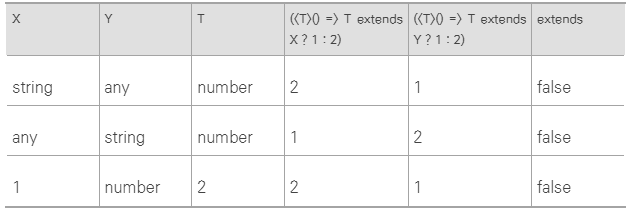

# 2.29 배운 것을 바탕으로 타입을 만들어보자

## 2.29.1 판단하는 타입 만들기.

### IsNever

- never인지 판단하는 IsNever타입.

```ts
type IsNever<T> = [T] extends [never] ? true : false;
```

- T에 never 넣을때 분배법칙 일어나는 것을 막기 위해 배열로 감싼 거 확인할 수 있다.

### IsAny

- any인지 판단하는 IsAny타입.

```ts
type IsAny<T> = string extends number & T ? true : false;
```

- T에 any가 들어와야 무조건 true 가 된다.

### IsArray

```ts
type IsArray<T> = IsNever<T> extends true
  ? false
  : T extends readonly unknown[]
  ? IsAny<T> extends true
    ? false
    : true
  : false;
```

- T extends unknown[] ? true : false 에는 반례가 있음. never, any, readonly [] 타입일 때 false 가 됨.
- 그걸 방지하기 위한 IsNever<T> extends true, IsAny<T> extends true, T extends readonly unknown[]

### IsTuple

- 배열 중 튜플만 판단하는 IsTuple 타입. 튜플이 아닌 배열 타입은 false가 되어야 함.

```ts
type IsTuple<T> = IsNever<T> extends true
  ? false
  : T extends readonly unknown[]
  ? number extends T["length"]
    ? false
    : true
  : false;
```

- number extends T["length"] 여기서 tuple인지 아닌지 판단하는 거임. 튜플은 length가 number가 아닌 개별 숫자임.
- any는 number extends T["length"]에서 걸러져서 따로 검사 안함.

### IsUnion

```ts
type IsUnion<T, U = T> = IsNever<T> extends true
  ? false
  : T extends T
  ? [U] extends [T]
    ? false
    : true
  : false;
```

- 유니언의 경우 컨디셔널 타입 제너릭과 만나면 분배 법칙 발생. T extends T 로 분배법칙을 만듬.
  ex) T가 string | number 일 때 T extends T 는 (string extends string | number) | (number extends string | number)
- U = T 를 통해 분배법칙이 일어나지 않은 원본 타입을 담아두었음. 최종적으로 [U] extends [T]는 [string | number] extends [string] 또는 [string | number] extends [number]가 됨. 그래서 union이 아니면 false가 됨.

## 2.29.2 집합 관련 타입 만들기.

### 차집합

- Omit은 특정 객체에서 지정한 속성을 제거하는 타입.

```ts
type Diff<A, B> = Omit<A & B, keyof B>;
type R1 = Diff<
  { name: string; age: number },
  { name: string; married: boolean }
>;
// type R1 = { age: number }

// A & B는 { name: string, age: number, married: boolean }
// keyof B는 name | married. 따라서 age 속성만 남음.
```

### 대칭차집합

```ts
type SymDiff<A, B> = Omit<A & B, keyof (A | B)>;
type R2 = SymDiff<
  { name: string; age: number },
  { name: string; married: boolean }
>;
// type R2 = { age: number, married: boolean }
```

- 아래 예시는 union에서 대칭차집합을 적용하는 방법

```ts
type SymDiffUnion<A, B> = Exclude<A | B, A & B>;
type R3 = SymDiffUnion<1 | 2 | 3, 2 | 3 | 4>;
// type R3 = 1 | 4
```

- Exclude <A | B, A & B>;
  - (A | B)타입에서 (A & B)을 제거하는 타입

### 동일 타입 판단 방법

- 아래는 A가 B의 부분집합이고 B도 A의 부분집합이면, 집합 A와 B가 서로 동일하다는 것을 코드로 나타낸 것

```ts
type Equal<A, B> = A extends B ? (B extends A ? true : false) : false;
```

- 분배 법칙 때문에 발생하는 반례 있음.

```ts
type R1 = Equal<boolean, true | false>;
// type R1 = boolean
type R2 = Equal<never, never>;
// type R2 = never
```

- 분배 법칙 안 나오게 바꿈.

```ts
type Equal<A, B> = [A] extends [B] ? ([B] extends [A] ? true : false) : false;
```

- 위의 타입도 any와 다른 타입을 구별하지 못함.

```ts
type R3 = Equal<any, 1>;
// type R3 = true
type R4 = Equal<[any], [number]>;
// type R4 = true
```

- any와 다른 타입을 구별하려면 Equal 타입을 다음과 같이 만들면 됨.

```ts
type Equal2<X, Y>
  = (<T>() => T extends X ? 1 : 2) extends (<T>() => T extends Y ? 1 : 2)
    ? true
    : false
```

- (<T>() => T extends X ? 1 : 2) 타입을 (<T>() => T extends Y ? 1 : 2) 타입에 대입할 수 있는지 묻는 것
- 아래 표에서 X, Y가 서로 다른 경우에 false가 되는 거 확인할 수 있음.



- 그러나 인터섹션을 인식하지 못하고 <any, unknown>의 경우에도 extends를 false로 만드는 T가 없음에도 false가 됨.

```ts
type R5 = Equal2<any, 1>;
// type R5 = false
type R6 = Equal2<{ x: 1 } & { y: 2 }, { x: 1, y: 2 }>;
// type R6 = false
type R7 = Equal2<any, unknown>;
// type R7 = false
```

### 다른 타입 판단 방법

```ts
type NotEqual<X, Y> = Equal<X, Y> extends true ? false : true;
```

- Equal 타입의 결과를 반대로 적용
