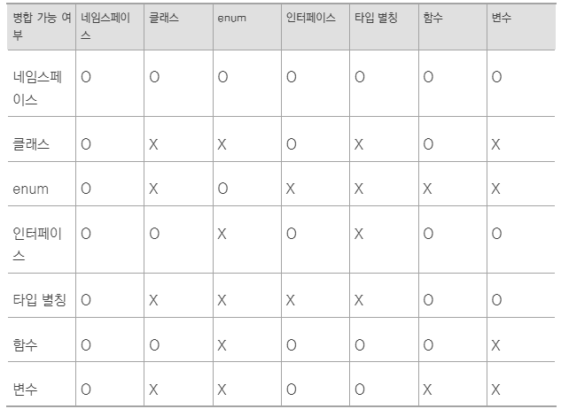

# 2.32 앰비언트 선언도 선언 병합이 된다.

- 자바스크립트로 된 남의 라이브러리를 사용할 때 직접 타이핑해야 하는 경우 생김. => 앰비언트 선언 사용
- declare 예약어 사용해야함.

```ts
declare namespace NS {
  const v: string;
};
declare enum Enum {
  ADMIN = 1
}
declare function func(param: number): string;
declare const variable: number;
declare class C {
  constructor(p1: string, p2: string);
};

new C(func(variable), NS.v);
```

- 구현부가 없음. 함수 func나 class C에도 타입만 있고 구현부가 존재하지 않음. 변수에도 타입만 있고 값을 대입하지 않음. 외부 파일에 실제 값이 존재한다고 믿는 거임. 없으면 에러.
- namespace를 declare로 선언하면 내부 멤버의 구현부를 생략할 수 있고 enum을 declare로 선언하면 자바스크립트로 변환할 때 실제 코드가 생성되지 않음.

```ts
declare interface Int {}
declare type T = number;
// 인터페이스와 타입 별칭도 declare로 선언할 수 있음.
// declare 선언하지 않아도 동일하게 작동하므로 굳이 declare를 붙일 필요 없음.
```


- 각각이 어떻게 사용되는지 나타낸 표 ex) 네임스페이스는 네임스페이스와 값으로 사용 가능



- 위의 표는 같은 이름의 다른 선언과 병합 가능 여부를 나타낸 표임.
- 인터페이스나 네임스페이스는 같은 이름으로 여러 개 존재할 때 병합. 함수는 오버로딩되므로 여러번 선언할 수 있음.
- 표를 외우기 쉽지 않음. 터페이스, 네임스페이스 병합이나 함수 오버로딩 같이 널리 알려진 경우를 제외하고는 웬만하면 같은 이름으로 여러번 선언하지 말자.

### 책에서 나온 선언 병합을 활용하면 좋은 예시


```ts
declare class A {
  constructor(name: string);
}
function A(name: string) {
  return new A(name);
}

new A('zerocho');
A('zerocho');
```

- 클래스가 있을 때 new를 붙이지 않아도 되게 하는 코드. class A는 앰비언트 선언이고 function A는 일반 선언임. 표에 따라 병합 가능

```ts
function Ex() { return 'hello'; }
namespace Ex {
  export const a = 'world';
  export type B = number;
}
Ex(); // hello
Ex.a; // world
const b: Ex.B = 123;
```

- 자바스크립트에서는 함수도 객체이므로 함수에 속성을 추가할 수 있음.
- 함수와 네임스페이스가 병합될 수 있으므로 위의 코드에서 에러 발생하지 않음. 별도로 있다는 걸 알리고 싶으면 함수와 동일한 이름의 namespace 추가하면 됨.
